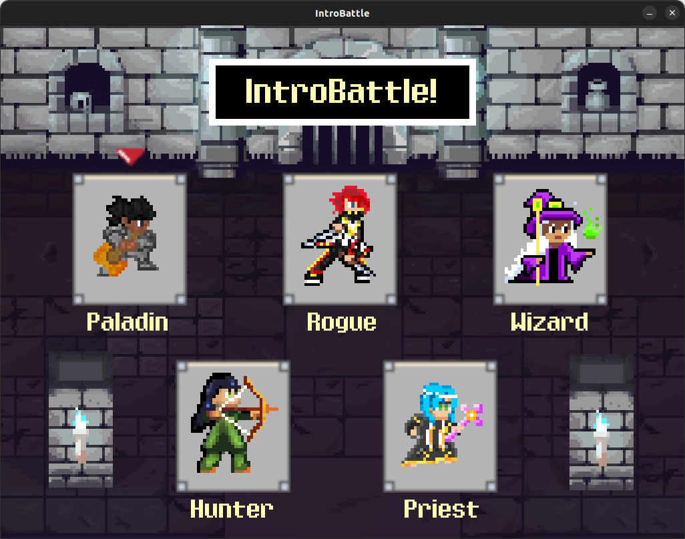
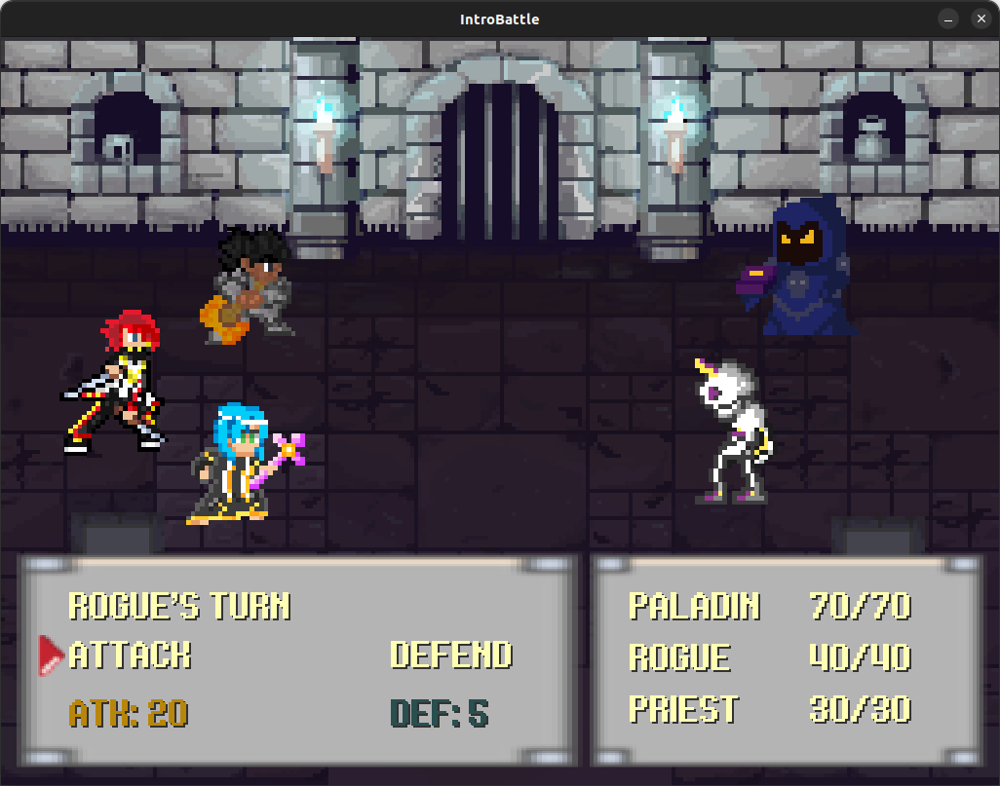

# IntroBattle-Pygame

## Table of Contents
- [Introduction](#introduction)
- [Installation](#installation)
- [Game preview](#game-preview)
- [Usage](#usage)
- [How to play](#how-to-play)
- [Contributing](#contributing)

## Introduction
IntroBattle-Pygame is a simple game developed using the Pygame library. In it, the player must initially choose 3 allies to battle against enemies in a turn-based combat.

## Game preview
<div style="text-align: center;">
  
  <p>Main menu</p>
</div>

<div style="text-align: center; margin-top: 20px;">
  
  <p>Battle</p>
</div>

## Installation

To install the game, follow these steps:

1. Clone the repository:
    ```bash
    git clone https://github.com/gabrielgatti7/IntroBattle-Pygame.git
    ```

2. Install python3:
    ```bash
    sudo apt-get install python3
    ```

## Usage

To start the game, run the following command:
```bash
python3 src/main.py
```

## How to play

To play the game, use the following controls:
- **Z key**: Select
- **X key**: Return
- **Arrow keys**: Navigate through the menu

## Contributing
Contributions are welcome! Please fork the repository and submit a pull request.